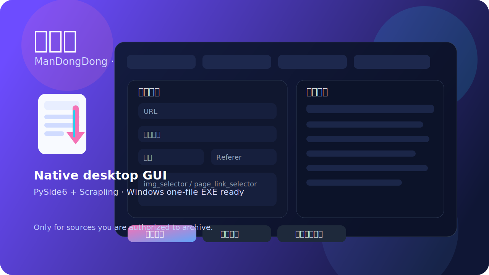

# 漫咚咚 / ManDongDong

[](https://github.com/ohmylady111/mandongdong/actions/workflows/windows-release.yml)
[](https://github.com/ohmylady111/mandongdong/releases)
[](./LICENSE)

A cute-yet-practical desktop downloader for **authorized manga / comic / gallery sources**.

> The app name shown in UI is **漫咚咚**. For better compatibility with Windows packaging tools, the EXE / installer filenames use **ManDongDong**.

[简体中文说明 / Chinese README](./README.zh-CN.md)



## What it is

ManDongDong is a PySide6 desktop GUI that wraps a Scrapling-powered downloader.
It is designed for:

- your own sites
- content you own
- sources you are explicitly authorized to archive, migrate, or back up

It is **not** intended for unauthorized scraping or bulk downloading of third-party copyrighted content.

## Current status

This repository is currently an **MVP**.

Working features:
- Native desktop window via PySide6
- URL / output directory / title / Referer / User-Agent inputs
- Multi-line `img_selector` / `page_link_selector`
- Dry-run preview
- Actual download mode
- Stop current task
- Save / load JSON presets
- Real-time logs
- Simple progress stats
- Windows one-file EXE / installer packaging scripts
- GitHub Actions workflow for Windows release builds

## Project structure

```text
.
├── authorized_manga_downloader.py          # core downloader logic
├── authorized_manga_downloader_desktop.py  # native desktop GUI (PySide6)
├── ManDongDong.spec                        # PyInstaller spec for stable packaging
├── make_program_icon.py                    # classic icon generator
├── make_program_icon_anime.py              # anime-style icon generator
├── windows-exe-bundle/                     # Windows packaging materials
├── .github/workflows/                      # GitHub Actions workflows
└── screenshots/                            # screenshots / hero assets
```

## Requirements

### Python runtime
- Python 3.10+

### Desktop GUI
- `PySide6>=6.8`

### Downloader engine
- `scrapling[all]>=0.4.2`

Install locally:

```bash
python3 -m pip install -r requirements.txt
```

## Run locally

```bash
python3 authorized_manga_downloader_desktop.py
```

## Windows packaging

See:
- `windows-exe-bundle/README-Windows.md`
- `windows-exe-bundle/START-HERE.txt`

Main Windows entry points:
- `windows-exe-bundle/run_native_ui_windows.bat`
- `windows-exe-bundle/build_native_ui_onefile.bat`
- `windows-exe-bundle/build_native_ui_installer.bat`

Expected outputs:
- `dist\ManDongDong.exe`
- `output\ManDongDong-Setup.exe`

## GitHub Actions release build

This repository now includes a Windows release workflow:

- Workflow file: `.github/workflows/windows-release.yml`
- Triggers:
  - manual dispatch
  - pushing a tag like `v0.1.1`

On tag builds, the workflow uploads `dist/ManDongDong.exe` as a release asset.

## Notes

- The desktop app can run its downloader worker in packaged/frozen mode, so the EXE is no longer tied to an external `.py` path.
- The current desktop app still launches the core downloader as a subprocess instead of re-implementing the download engine.
- Stop is currently a hard stop / process termination in MVP.
- Progress is estimated primarily by page-level signals, not exact per-image progress.
- First-time Scrapling runtime setup may take a while.

## Safety / intended use

Only use this project for sources you are authorized to access and archive.

## License

[MIT](./LICENSE)
